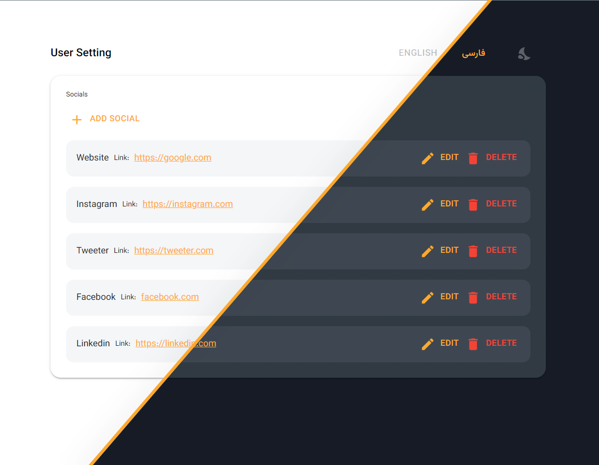

This is a [Next.js](https://nextjs.org/) project with the implementation of CRUD
 operation on the social media links.


## Tech Stack

**Client:** [Next.js](https://nextjs.org/), [React](https://reactjs.org/), [TypeScript](https://www.typescriptlang.org/), [Material UI](https://mui.com/)

**Data Fetching:** [Axios](https://axios-http.com/), [React Query](https://react-query.tanstack.com/)

**Form library:** [Formik](https://formik.org/), [Yup](https://www.npmjs.com/package/yup)

**Internationalization :** [i18next](https://www.i18next.com/)

**Mock Server:** [JSON Server](https://github.com/typicode/json-server)


## Run Locally

After cloning the project, go to the project directory and install the dependencies.

```bash
  npm install
```

Then start the server

```bash
  npm run dev
```
Open http://localhost:3000 with your browser to see the result.
## JSON Server

If you want to run JSON Server locally you should follow these commands

```bash
npm i json-server
json-server --watch db.json --port 8080
```
You can use `npx` instead
```bash
npx json-server --watch db.json --port 8080
```
